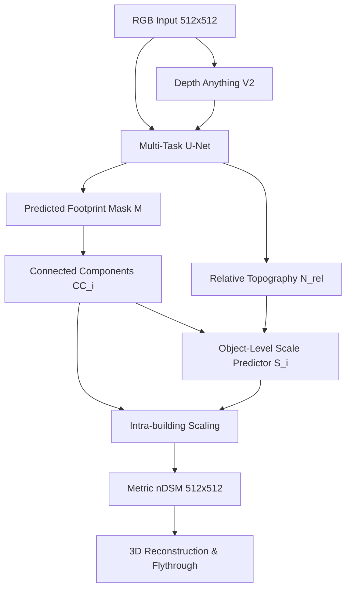

# PHASE 19A — BUILDING-CONDITIONED HEIGHT MODEL DESIGN

## 1. Phase-18 Diagnostic Evidence

Phase 18 proved that **object-level (individual building) localization** successfully bypasses the scale collapse of direct scene-level regressions.
- **Tile-level scale MAE (Phase 17B):** `47.99m` (Pearson R: `0.060`)
- **Building-level height MAE (Phase 18, Predicted masks):** **`28.84m`** (Pearson R: **`0.312`** | Spearman R: **`0.378`**)
- **Building-level height MAE (Phase 18, Oracle masks):** **`26.94m`** (Pearson R: **`0.281`** | Spearman R: **`0.310`**)

Spatiotemporally aggregating visual/depth signals into a single scene-level scale target ($P_{99}$) flattens footprint complexity and collapses predictions under zero-shot transfer. In contrast, localizing regressions to individual building footprints preserves GSD-anchored spatial footprints (like area and bounding boxes) and relative depth boundaries. This yields a strong transferable scale signature across cities (unseen New York zero-shot).

---

## 2. Literature Review and Novelty Assessment

### Existing standard methods do:
- **Building Segmentation:** Segmenting footprints from satellite imagery (standard U-Net/Mask R-CNN).
- **Depth Fusion:** Concatenating visual features with depth features (standard in HTC-DC Net, HGDNet).
- **Multi-Task Learning:** Jointly learning height and segmentation (standard in IM2HEIGHT, HTC-DC).

### Our proposed model does:
- **Scale-Decoupled Object Scaling:** Extracts normalized relative-depth topology ($N$) from a foundation model, segments building footprint components ($F$), and applies **physical GSD-anchored footprint geometry** as a vertical scaling anchor ($S$) for zero-shot transfer.

### The technical difference is:
Existing methods map RGB directly to metric height, suffering from scale collapse on unseen cities because they learn city-specific absolute height shortcuts. Our model decouples structure from scale, using the horizontal resolution metric ($0.5$m GSD) of predicted footprints to reason about vertical metric scale.

### The failure evidence motivating it:
Direct relative-depth scale regressors collapsed on New York (Phase 15B/17B, negative correlation $R = -0.187$), whereas local building footprints stabilized the scaling target (Phase 18, MAE reduced by $19.15$m).

---

## 3. Proposed Architectures

We design three building-conditioned candidates:

### Candidate A: Decoupled Multi-Task Segmentation & Scale Regressor (DMT-SSR)
- **Structure:** Shared backbone feeds into two heads: a Footprint Segmentation Head (outputs binary mask $M$) and a Relative Depth Refinement Head (outputs normalized height map $N_{rel} \in [0, 1]$).
- **Scale Estimation:** A lightweight MLP takes the segmented masks, computes connected components, extracts geometric stats (area, aspect ratio, perimeter), and predicts a scene-level scale $S_c$ which is multiplied by the refined relative depth map: $nDSM = M 	imes (N_{rel} 	imes S_c)$.
- **Cons:** A single scene-wide scale $S_c$ ignores per-building variations.

### Candidate B: Object-Oriented Topographical Scaling Network (OOTS-Net) [RECOMMENDED]
- **Structure:** A Multi-Task U-Net extracts footprint mask $M$ and relative topography $N_{rel}$. Individual components are extracted from $M$.
- **Scale Estimation:** For each individual building component $i$, a Scale Network predicts an absolute metric height scale $S_i$ using local geometric features (GSD-anchored footprint area, bounding box aspects) combined with local relative-depth statistics.
- **Topography Preservation:** To preserve intra-building roof topology, we extract the relative-depth patch $N_{rel, i}$ inside component $i$, min-max normalize it locally to $[0, 1]$, and multiply it by the predicted building scale $S_i$:
  $$h_{pixel} = (S_i - 2.0) 	imes rac{N_{rel, i} - \min(N_{rel, i})}{\max(N_{rel, i}) - \min(N_{rel, i}) + \epsilon} + 2.0$$
- **Pros:** Directly leverages the Phase 18 evidence, models height variation per-building, and preserves fine roof topologies.

### Candidate C: Ordinal-Continuous Distribution Refinement Network (OC-DRN)
- **Structure:** Predicts coarse height intervals (ordinal bins: $>10$m, $>20$m, $>30$m, $>40$m) and continuous height residuals.
- **Topography Preservation:** Pixel-level topography is added via residual convolution blocks.
- **Cons:** Complex loss formulation and higher implementation cost.

---

## 4. Tall-Tail Strategy

To resolve the tail-collapse ($>40$m skyscrapers) without creating classification artifacts:
1.  **Logarithmic Targets:** Train regressions on $\log_{1p}(	ext{Height})$ to compress the variance of the tail.
2.  **Tall-Building Focal Loss:** Apply a weighted MSE loss that scales with the true height:
    $$L_{scale} = \sum_i w_i (S_i - \hat{S}_i)^2, \quad w_i = 1.0 + \gamma \log_{1p}(H_i)$$
    where $H_i$ is the true building height, and $\gamma = 2.0$ increases the gradient weight of tall buildings.

---

## 5. Deployment Path



---

## 6. Smallest Falsifiable Experiment

**Setup:** Retrain the U-Net footprint and relative-depth heads on 128 multi-city training tiles. Evaluate the **OOTS-Net (Candidate B)** scale predictor on New York buildings.
**Falsification Threshold:** If the zero-shot P95 height prediction MAE on New York buildings is **$> 32	ext{m}$**, or if the Pearson correlation is **$< 0.20$**, the object-level scale reasoning is falsified and must be abandoned.

---

## 7. Recommended Action

```text
PROCEED TO IMPLEMENTATION
```
We recommend implementing **Candidate B (OOTS-Net)**. It directly matches our statistical evidence, preserves physical horizontal constraints (GSD-anchored footprint area), and retains relative local roof topology.
