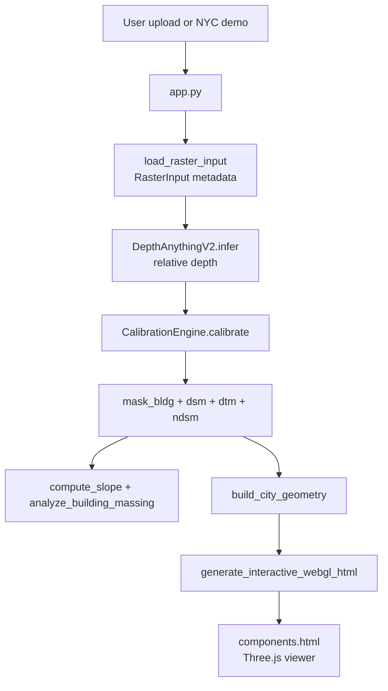
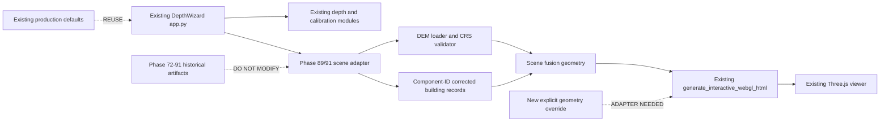

# Phase 92: DepthWizard integration architecture audit

## Scope

This is an architecture-only audit. No production code, model weights, thresholds, Phase 72 rasters, or Phase 87-91 artifacts were modified.

## Current architecture map



There is no separate frontend/backend service or API endpoint in the repository. The frontend is Streamlit, Python performs inference and geometry preparation, and the generated HTML embeds the Three.js application.

## Current terrain path

| Capability | Actual implementation | Current behavior |
|---|---|---|
| DEM loading | No production Phase 72 DEM loader in `app.py` | Uploaded raster is treated as the main surface input; a reference DSM is only looked up for the bundled NYC demo |
| DTM generation | `depthwizard/calibration/engine.py:CalibrationEngine.extract_dtm` | Morphological opening plus Gaussian smoothing; input is an elevation raster; output is float terrain-like elevation in the input units |
| DSM generation | `depthwizard/calibration/engine.py:CalibrationEngine.calibrate` | Produces `CalibrationResult.dsm`; metric only when a reference/GCP path supports it, otherwise relative mode is possible |
| Terrain mesh | `depthwizard/viz/interactive_viewer.py:build_city_geometry` | Resizes `dtm` to a stride-reduced grid and creates local x/y/z positions; y is elevation relative to `z_base`, with optional exaggeration |
| Geospatial handling | `depthwizard/data/raster_loader.py:RasterInput` | Preserves CRS, affine transform, bounds, and GSD, but the viewer contract does not propagate them into JavaScript |

The current viewer's terrain is therefore not automatically the Phase 72 real georeferenced DEM. A DEM-aware adapter is required.

## Current building path

`CalibrationEngine._load_models()` loads `runs/phase43_augmented_unet/unet_config_D.pt` when present, falling back to `runs/phase24_moe/seed_0/model.pt`. The estimator is `BuildingConditionedEstimator`, whose underlying `BuildingConditionedHeightNet` uses a `SmallFusionUNet` backbone with RGB plus depth input.

`CalibrationEngine.extract_building_footprint()` calls the estimator at its configured resolution, applies sigmoid, and uses the inherited threshold `0.5`. The model's `forward()` creates connected components, sorts them by descending area, caps them at 25, and emits object-level predictions. The Phase 89 correction is not currently part of this production path.

There are two additional divergences:

- `CalibrationEngine` can use Phase 29 `PeakRecoveryMLP` for structural-prior calibration when a reference elevation is supplied.
- `build_city_geometry()` documents and implements its own multi-evidence mask reconstruction and watershed instance separation from `dsm`, `dtm`, and RGB. It does not treat `mask_bldg` or Phase 89 component-ID height records as authoritative building geometry.

Therefore Phase 89/91 cannot be connected safely by passing only the existing `mask_bldg`. It needs an adapter that produces explicit component-ID records and viewer geometry.

## Depth Anything V2 path

- Loading: `DepthAnythingV2._ensure_pipe()` creates a Hugging Face `depth-estimation` pipeline for `Depth-Anything-V2-Small-hf`.
- Inference: `DepthAnythingV2.infer(rgb, key, target_hw)` converts input to a PIL image, resizes to the configured input size (typically 518), runs inference, extracts `predicted_depth`, and resizes to the requested target shape.
- Output: float32 relative depth, scale- and shift-ambiguous; it is not a metric elevation sensor.
- Production entry: `app.py` calls `depth_model.infer(...)` before `CalibrationEngine.calibrate(...)`.

The model can remain available as a frozen vision input, but the Phase 89/91 Indian scene path must not reinterpret it as metric terrain.

## Current 3D viewer

Entry point: `depthwizard/viz/interactive_viewer.py:generate_interactive_webgl_html`.

Geometry entry point: `build_city_geometry`.

The viewer already supports:

- terrain mesh
- multiple roof and wall meshes
- RGB texture draping through UVs/base64 JPEG
- local scene bounds and camera framing
- orbit, pan, zoom through `THREE.OrbitControls`
- camera presets: overview, urban, inspection, top, street
- reset through `resetView`
- WASD/arrow first-person movement
- render modes for RGB, elevation, building height, and slope
- building picking and an inspector HUD

The viewer does not currently support authoritative `height_available=false` records or CRS-aware world coordinates. Unavailable buildings would need footprint-only geometry/metadata and an inspector/UI representation in the adapter/viewer contract.

## Safe integration point

The smallest safe insertion point is immediately before the existing call in `app.py`:

```python
webgl_html = generate_interactive_webgl_html(...)
```

A later implementation phase should add a new Phase 89 scene adapter that returns the viewer's existing terrain/roofs/walls/buildings schema, then add an optional geometry override to the HTML generator. The default existing geometry path should remain unchanged.



## Data contract summary

The detailed contract is in `DATA_CONTRACT.json`. The essential required fields are:

- Terrain: elevation, x/y coordinates, resolution, bounds, CRS, affine transform, local viewer origin, and nodata policy.
- Buildings: component_id, footprint, height, base_elevation, roof_elevation, height_available, area, and missing_height_reason.
- Every finite height must be assigned through `predicted_height_by_component_id`.
- Missing heights remain `height=null` and `height_available=false`; they are never zero-filled, interpolated, or silently removed.

## Integration risk summary

The highest risks are CRS mismatch, pixel/world scaling, height-unit mismatch, DEM nodata, footprint projection, missing-height handling, and divergence between the production calibration/viewer path and Phase 89. The complete register with severity and mitigations is in `RISK_REGISTER.json`.

## Exact minimal plan

1. Add an isolated Phase 89/91 scene adapter; do not copy experiment scripts into `app.py`.
2. Validate common-grid CRS, transform, shape, resolution, finite DEM coverage, and RGB alignment.
3. Convert Phase 89 component records to explicit component-ID keyed viewer records.
4. Generate finite-height roof/wall geometry and footprint-only `HEIGHT_UNAVAILABLE` records.
5. Add an optional prebuilt-geometry override at the existing viewer boundary.
6. Preserve existing Streamlit state, camera controls, rendering modes, and default path.
7. Run serialization, geometry, and existing viewer smoke checks before any default enablement.

## Final decision

INTEGRATION_POINT_IDENTIFIED
