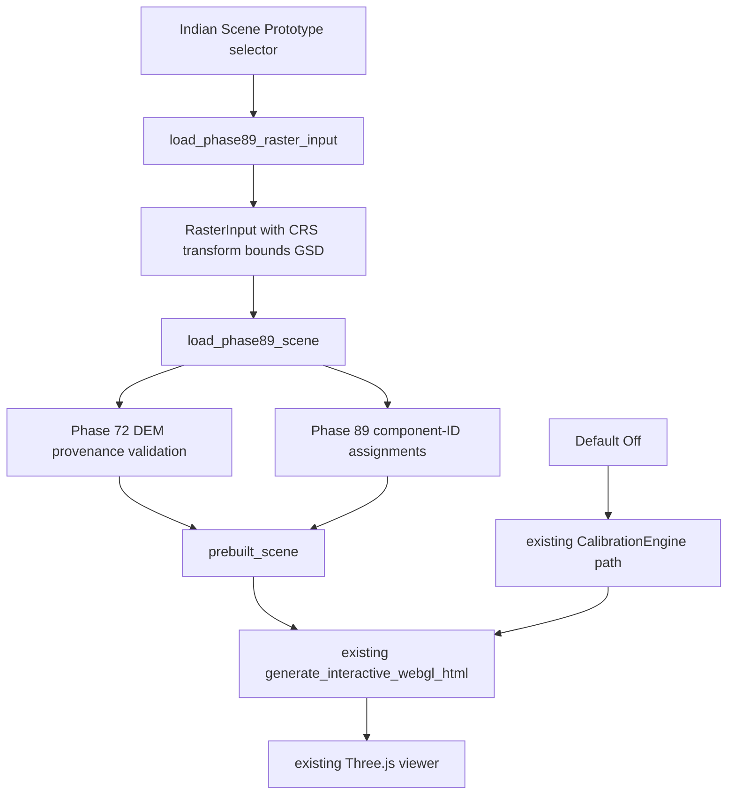

# Phase 93: DepthWizard Indian scene integration

## Scope

Phase 93 integrates the validated Indian terrain/building scene path into the existing DepthWizard application. The default non-Indian path remains available. Historical Phase 72-91 artifacts were not modified.

TERRAIN_SOURCE = REAL GEOREFERENCED DEM
BUILDING_SOURCE = SINGLE-VIEW MODEL
HEIGHT_MAPPING = PHASE 89 COMPONENT-ID CORRECTED
HEIGHT_ACCURACY = UNVALIDATED
CANNY = OPTIONAL STRUCTURAL REFINEMENT
POINT_CLOUD = OPTIONAL XYZ REPRESENTATION
SIKKIM = LOCKED

## Production changes

- Added `depthwizard/integration/phase89_scene_adapter.py` to load persisted Phase 89/91 scene artifacts, validate real Phase 72 DEM metadata, and emit the existing viewer scene schema.
- Added an optional `prebuilt_scene` argument to `generate_interactive_webgl_html`; when absent, the prior geometry path remains active.
- Added null-safe handling for unavailable heights in the existing viewer camera and inspector logic.
- Added an opt-in Streamlit Indian Scene Prototype selector for Uttarakhand and Himachal Pradesh.
- Added Canny and point-cloud toggles, both disabled by default and non-authoritative.
- Added focused tests in `tests/test_phase93_integration.py`.

## Integrated pipeline

## Data contract

The adapter carries terrain elevation, CRS, affine-derived bounds, resolution, units, and nodata provenance. Buildings carry component ID, footprint-derived mesh identity, height, base elevation, roof elevation, `height_available`, selection status, and missing-height reason.

Unavailable heights remain `height_m=null` and `height_available=false`. They are not zero-filled, interpolated, fabricated, or silently deleted. The viewer inspector displays `HEIGHT_UNAVAILABLE`, and unavailable records receive no numeric roof/wall extrusion.

## Validation

- Default viewer fallback: PASS.
- Uttarakhand prebuilt scene: PASS; EPSG:32644; 11 buildings; 9 finite heights; 2 unavailable; mapping mismatches 0.
- Himachal prebuilt scene: PASS; EPSG:32643; 1 building; 1 finite height; 0 unavailable; mapping mismatches 0.
- Existing controls preserved: orbit, pan, zoom, reset camera, presets, render modes, and ray picking.
- Focused tests: 5 passed.
- Strict JSON serialization: passed for both Indian scene contracts.
- No Indian building ground truth exists; no accuracy metrics are reported.

## Optional features

Canny is an optional structural-boundary refinement/inspection layer and is off by default. It does not replace segmentation or change authoritative Phase 89 component IDs/heights.

Point cloud is an optional XYZ representation/export layer and is off by default. It does not repair or infer missing heights.

## Performance evidence

- Default HTML generation: 0.1365 s, 75,712 bytes.
- Uttarakhand adapter: 1.2558 s; HTML generation: 1.1242 s; payload: 59,116,176 bytes.
- Himachal adapter: 1.3331 s; HTML generation: 1.1491 s; payload: 59,213,783 bytes.
- Each integrated scene uses 262,144 terrain vertices.

The large embedded payload is a known performance risk; no premature optimization was performed.

## Scientific language

This output is an INDIAN 3D SCENE PROTOTYPE with a REAL TERRAIN BASE. It is not validated building-height reconstruction. The Phase 89 height mapping is preserved, but Indian building-height accuracy remains UNVALIDATED.

## Final decision

DEPTHWIZARD_INDIAN_SCENE_INTEGRATED
